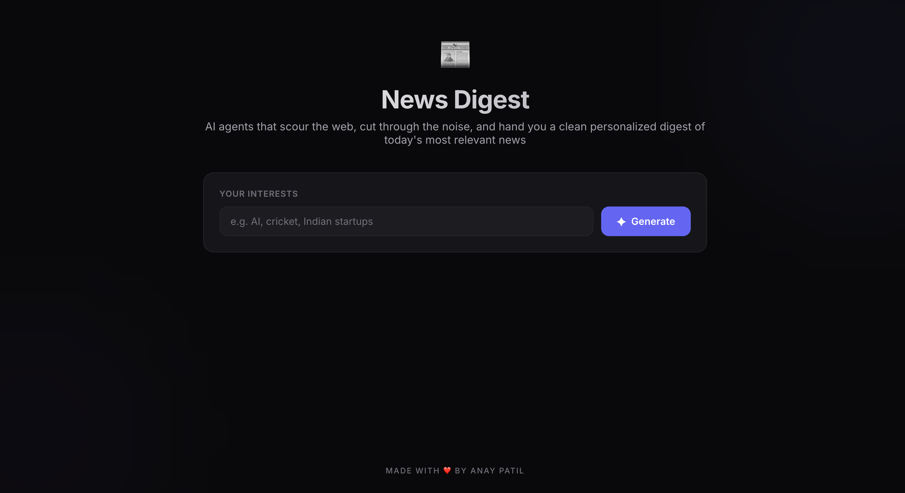
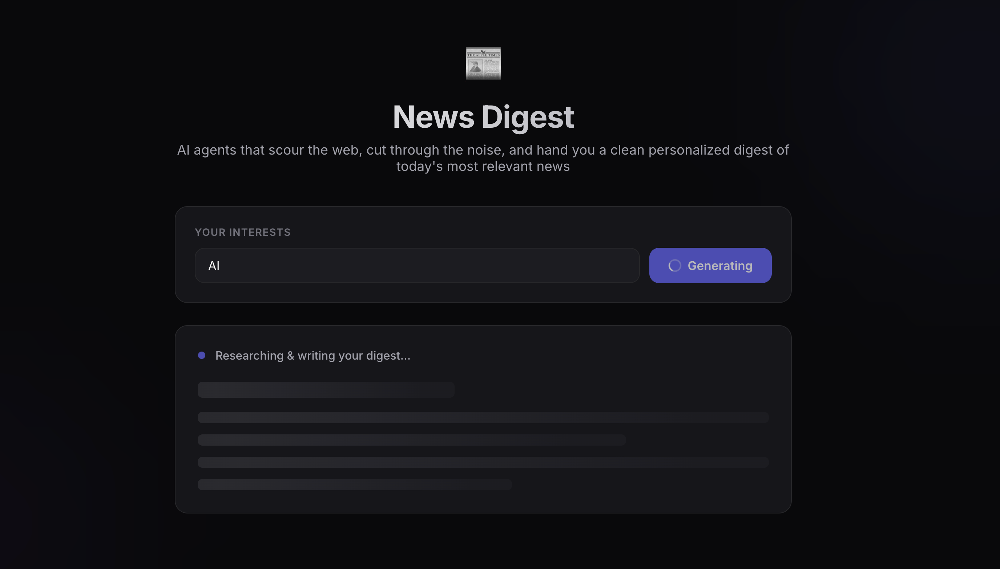
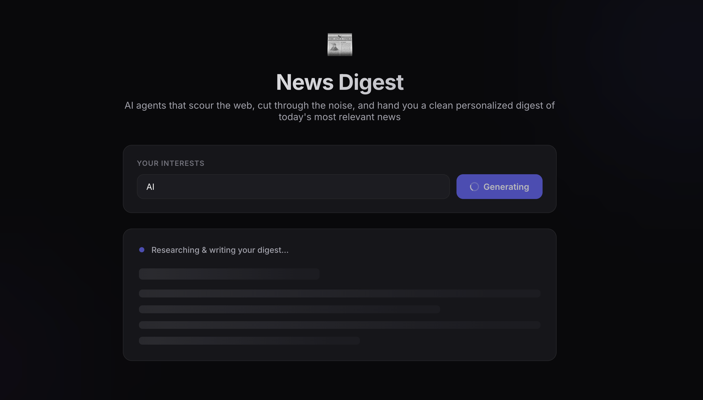

# 📰 News Digest Agent

An **Agentic AI** application that autonomously researches the web, curates the most relevant articles, and generates a clean, personalized news digest — all powered by a multi-agent architecture built with LangChain.

## Screenshots

| Initial State | Loading | Generated Digest |
|:---:|:---:|:---:|
|  |  |  |

## Architecture

```
User Input (Interests)
        │
        ▼
┌─────────────────────┐
│   Research Agent     │  ← Tavily Search + Article Fetcher + Relevance Filter
│   (Tool-Calling)     │
└────────┬────────────┘
         │ Raw research data
         ▼
┌─────────────────────┐
│   Writer Agent       │  ← GPT-5-mini with streaming output
│   (LLM Chain)        │
└────────┬────────────┘
         │ Streamed markdown
         ▼
┌─────────────────────┐
│   React Frontend     │  ← Real-time streaming + Markdown rendering
└─────────────────────┘
```

### Research Agent
- Uses **tool-calling** via LangChain's `AgentExecutor`
- Tools: `TavilySearch`, `ArticleFetcher` (BeautifulSoup), `RelevanceFilter`
- Searches once per topic with date-aware queries for fresh results
- Returns structured article data (title, URL, snippet, topic)

### Writer Agent
- LLM chain with `StrOutputParser` for token-level streaming
- Transforms raw research into a structured, readable digest
- Grouped by topic with summaries and source links

## Tech Stack

| Layer | Technology |
|-------|-----------|
| **Frontend** | React 19 · Vite · react-markdown |
| **Backend** | FastAPI · Uvicorn · StreamingResponse |
| **AI/LLM** | LangChain · OpenAI GPT-5-mini |
| **Search** | Tavily API |
| **Scraping** | BeautifulSoup4 · Requests |

## Getting Started

### Prerequisites
- Python 3.12+
- Node.js 18+
- [uv](https://docs.astral.sh/uv/) (Python package manager)
- OpenAI API key
- Tavily API key

### Backend

```bash
cd backend

# Create .env file
cat > .env << EOF
OPENAI_API_KEY=your_openai_key
TAVILY_API_KEY=your_tavily_key
EOF

# Install dependencies & run
uv sync
uv run uvicorn src.main:app --reload
```

Backend runs at `http://localhost:8000`

### Frontend

```bash
cd frontend
npm install
npm run dev
```

Frontend runs at `http://localhost:5173`

## API

| Method | Endpoint | Description |
|--------|----------|-------------|
| `GET` | `/` | Health check |
| `POST` | `/generate-digest` | Generate a streaming news digest |

### POST `/generate-digest`

```json
{
  "interests": ["AI", "cricket", "Indian startups"]
}
```

Returns a `text/plain` streaming response with markdown-formatted digest.

## Project Structure

```
news-digest-agent/
├── backend/
│   └── src/
│       ├── main.py                # FastAPI app with streaming endpoint
│       ├── agents/
│       │   ├── research_agent.py  # Tool-calling agent for web research
│       │   └── writer_agent.py    # LLM chain for digest generation
│       └── tools/
│           ├── search.py          # Tavily search wrapper
│           ├── fetcher.py         # Article content scraper
│           └── filter.py          # Relevance filter
├── frontend/
│   └── src/
│       ├── App.jsx                # Main app with streaming + markdown
│       ├── App.css                # UI styles
│       └── main.jsx               # Entry point
└── README.md
```

---

<p align="center"><b>MADE WITH ❤️ BY ANAY PATIL</b></p>
